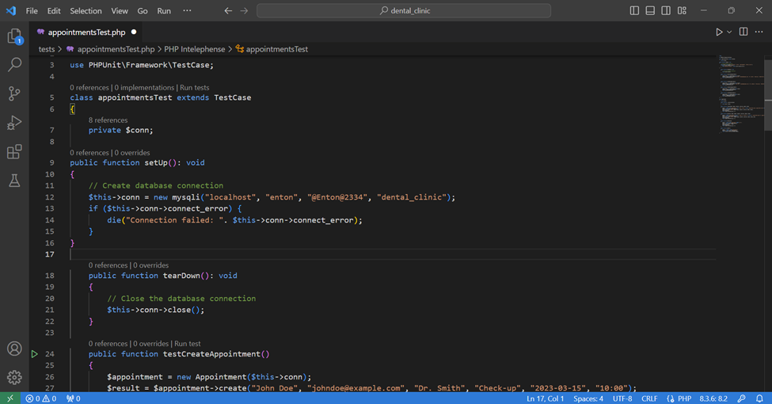
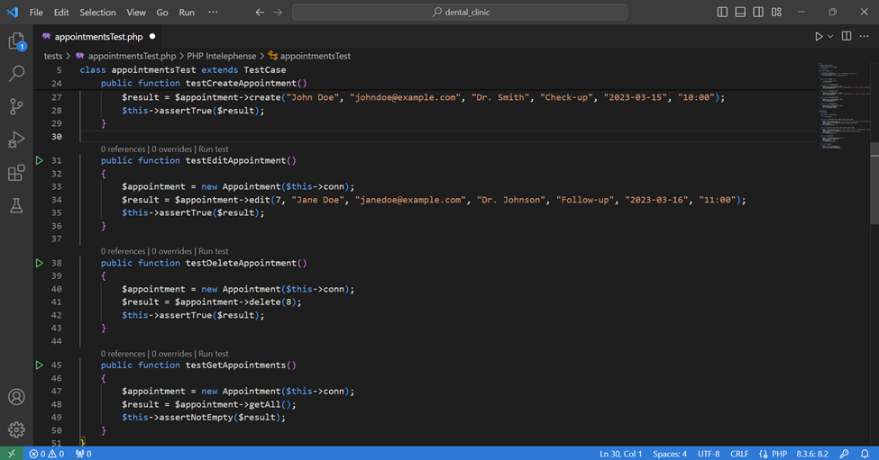
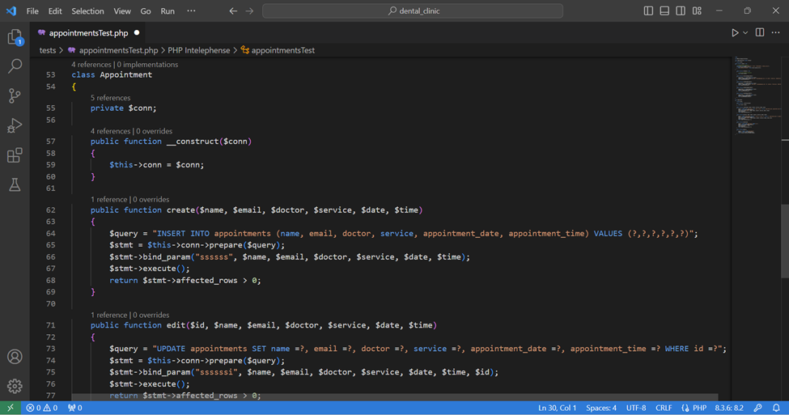
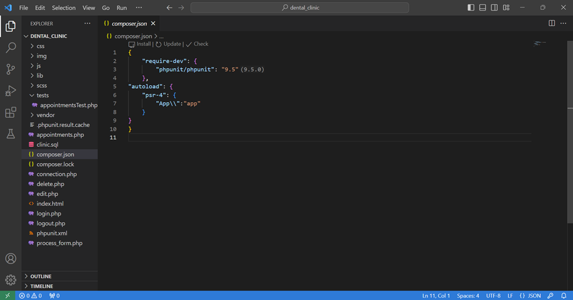
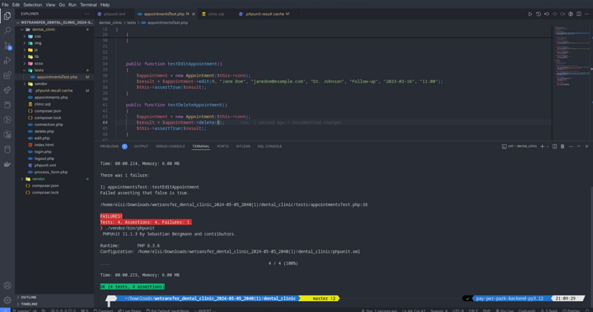

## Project Title: Dental Care ProTech
# Introduction to Testing:
Software testing is the process of evaluating a software component or system to identify defects or bugs. It involves executing the software under specific conditions and comparing its expected behavior with its actual behavior. Testing is crucial in software development to ensure reliability, correctness, and quality of the final product.
# Purpose of Testing:
The purpose of testing is to identify defects early in the development process and verify that software components perform as intended. By thoroughly testing each component, developers can ensure that the software meets the requirements and functions correctly in various scenarios.
# Focus on Testing a Single Component:
The chosen component for testing is the Appointment class within the appointmentsTest.php file. This class encapsulates the functionality related to managing appointments in the dental clinic system.
Testing this component is crucial due to the following reasons:

Role: The Appointment class handles the creation, editing, deletion, and retrieval of appointment data from the database. As appointments are a core feature of the dental clinic system, ensuring the correctness of this component is vital for the overall system's functionality.

Impact on the System: Incorrectly managed appointments can lead to scheduling conflicts, loss of data, or disruption in patient care. Therefore, thorough testing of this component can prevent such issues and ensure the reliability of the system.
# Preparing Test Cases: The test code: appointmentsTest.php

.json file

.xml file

Final output

setUp() and tearDown() Methods:

The setUp() method is executed before each test method in the class. It establishes a database connection using mysqli and sets it to $this->conn.

The tearDown() method is executed after each test method. It closes the database connection to ensure clean-up.

testCreateAppointment() Method:
This method tests the create() function of the Appointment class. It creates a new instance of the Appointment class, passing the database connection ($this->conn) as a parameter.

It calls the create() method with sample data for a new appointment (name, email, doctor, service, date, time).

The return value of the create() method is stored in $result.

The assertion assertTrue($result) verifies that the appointment creation was successful.

### The purpose of this test is to ensure that the create() method of the Appointment class properly inserts a new appointment into the database. If the method works as expected, it should return true, indicating successful insertion.

## Choosing Testing Frameworks:
For PHP-based testing, PHPUnit is a popular choice for unit testing. It provides a robust framework for writing and executing tests. Additionally, PHPUnit supports various assertion methods for validating test outcomes. To set up PHPUnit for testing, we install PHPUnit via Composer: composer require --dev phpunit/phpunit

## Test Coverage:
High test coverage is essential to ensure thorough testing of software. It helps identify areas of the codebase that lack proper testing and reduces the likelihood of undiscovered bugs.
Achieving high test coverage involves:
1. Writing comprehensive test cases that cover different functionalities and scenarios.
2. Ensuring that tests exercise various paths through the code, including edge cases and error conditions.
3. Regularly reviewing and updating tests to accommodate changes in the codebase.

